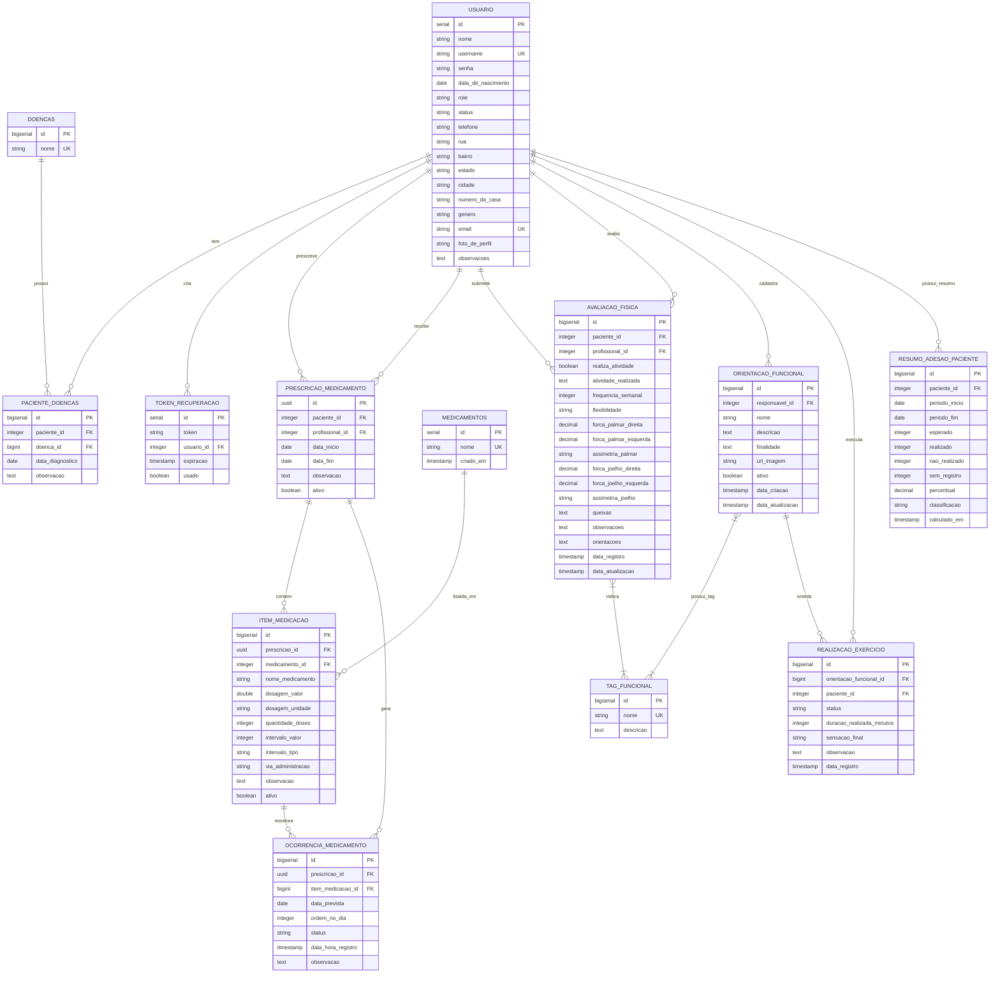

# Hora de Cuidar (HDC)

## Visão Geral

O **Hora de Cuidar (HDC)** é um sistema voltado para o acompanhamento de pessoas com doenças crônicas, com foco nos pilares de **medicação**, **nutrição** e **atividade física**.

O objetivo do sistema é auxiliar profissionais de saúde no planejamento e monitoramento dos tratamentos, ao mesmo tempo em que incentiva os pacientes a seguirem corretamente as recomendações definidas.

---

## Padrão de Commits

O projeto utiliza um padrão de commits baseado no **Conventional Commits**, com o objetivo de manter um histórico claro, padronizado e fácil de entender.

Cada commit deve seguir o formato: `<emoji><tipo>(escopo): <descrição curta>`

Exemplo: ✨feat(backend): adicionar cadastro de pacientes

A tabela abaixo define o padrão de **tipos de commit** adotado no projeto, associando cada tipo a um **emoji** correspondente.  

| Type     | Emoji                 | code                    |
|:---------|:----------------------|:------------------------|
| feat     | :sparkles:            | `:sparkles:`            |
| fix      | :bug:                 | `:bug:`                 |
| docs     | :books:               | `:books:`               |
| style    | :gem:                 | `:gem:`                 |
| refactor | :hammer:              | `:hammer:`              |
| perf     | :rocket:              | `:rocket:`              |
| test     | :rotating_light:      | `:rotating_light:`      |
| build    | :package:             | `:package:`             |
| ci       | :construction_worker: | `:construction_worker:` |
| chore    | :wrench:              | `:wrench:`              |

--- 

## Fluxo de Desenvolvimento e Controle de Branches

Este projeto adota um fluxo de versionamento baseado em **Pull Requests**, com o objetivo de garantir maior organização, qualidade do código e evitar alterações diretas em branches críticas.

### Estrutura de Branches

- **`main`**  
  Branch estável, que representa a versão principal do sistema.

- **`developer`**  
  Branch de integração, onde as funcionalidades são consolidadas antes de irem para a `main`.

- **`feat/*`**  
  Branches utilizadas para o desenvolvimento de novas funcionalidades, correções ou melhorias.

### Restrições de Push

Para manter a integridade do código:

- ❌ **Push direto é bloqueado** nas branches `main` e `developer`
- ✔️ Alterações nessas branches **só podem ocorrer via Pull Request**
- ✔️ Pull Requests podem exigir revisão antes do merge

Essas regras são aplicadas através das **Branch Protection Rules** do GitHub.

---

### Fluxo de Trabalho

1. Criar uma branch a partir de `developer`:
   ```bash
   git checkout -b feat/nova-funcionalidade
    ```
2. Desenvolver a funcionalidade e realizar commits normalmente.
3. Abrir um Pull Request de:
   ```
   feat/* → developer
    ```
4. Após validação e aprovação, a branch é integrada à developer.
5. Quando o conjunto de funcionalidades estiver estável, é aberto um Pull Request de:
      ```
   developer → main
    ```
---

## Backend

O backend do **Hora de Cuidar (HDC)** é desenvolvido em **Java** utilizando o **Spring Boot**, seguindo uma arquitetura orientada a APIs REST para atender tanto a versão desktop quanto a versão mobile do sistema.

A aplicação é responsável por gerenciar regras de negócio, autenticação, persistência de dados e integração com o banco de dados.

### Modelagem do Sistema


### Principais Tecnologias e Ferramentas

- **Spring Boot**: base do projeto, facilitando a configuração e o desenvolvimento da aplicação
- **Spring Web**: criação de endpoints REST
- **Spring Data JPA**: acesso e persistência de dados
- **Spring Security**: controle de autenticação e autorização
- **JWT (JSON Web Token)**: autenticação baseada em tokens
- **PostgreSQL**: banco de dados relacional
- **Flyway**: versionamento e controle de migrations do banco de dados
- **MapStruct**: mapeamento entre entidades e DTOs
- **Lombok**: redução de código boilerplate
- **Maven**: gerenciamento de dependências e build do projeto

---

## Como executar o projeto com Docker Compose

### Pré-requisitos
- Docker instalado
- Docker Compose disponível (Docker Desktop ou plugin do Docker)

### Instruções

Antes de subir os containers, crie um arquivo `.env` na raiz do projeto para definir as variáveis de ambiente.

Exemplo de `.env`:

```env
POSTGRES_DB=hdc
POSTGRES_USER=hdc
POSTGRES_PASSWORD=hdc
POSTGRES_HOST=db
POSTGRES_PORT=5432

SPRING_PROFILES_ACTIVE=prod
JWT_SECRET=chave_secreta_exemplo
```

Construa a imagem, usando o comando:

    - "docker-compose build"

Depois, suba o container, usando o comando:

    - "docker-compose up"

- Acesse o Back-end: O servidor estará disponível em http://localhost:8080.

---

## Status do Projeto

📌 Em desenvolvimento

---
